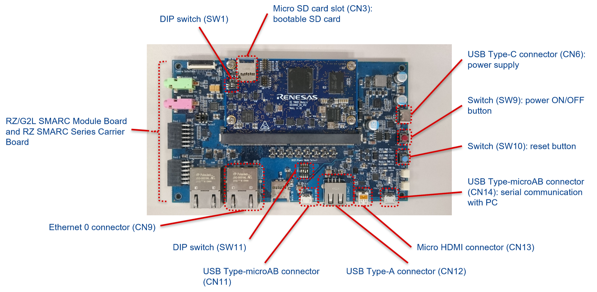
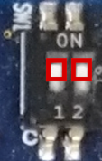
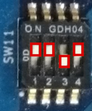
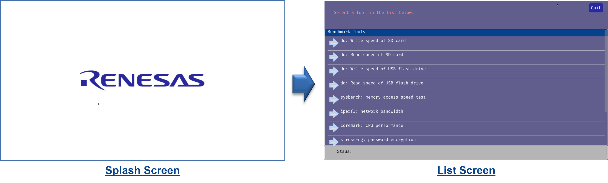
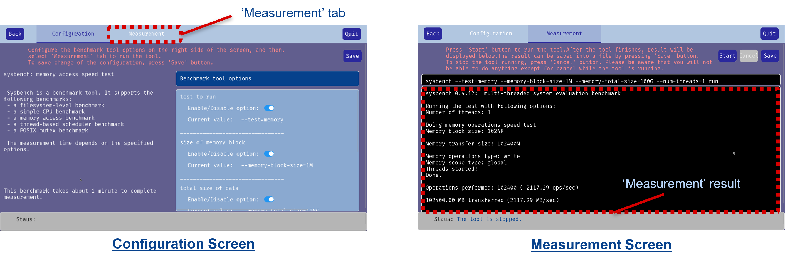
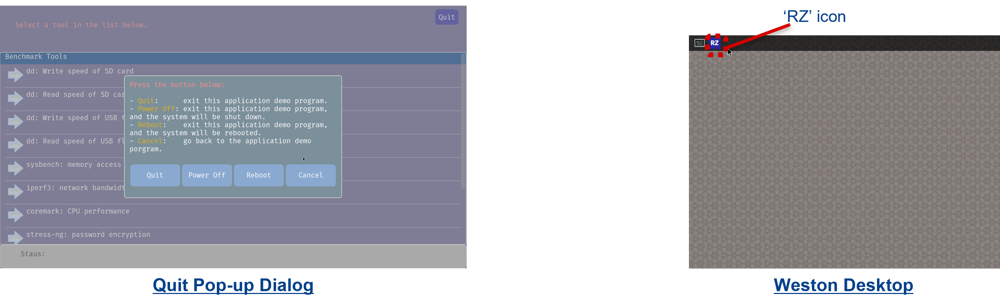

## How to Use RZ Linux Benchmark Demo

To set up the RZ Linux Benchmark Demo, use a PC with one of the following OSes.
* Ubuntu 20.04 LTS
* Windows 10

---

### Step 1. Set up the Evaluation Board Kit



#### Step 1-1. Connect RZ Evaluation Board Kit and peripheral devices

The demo uses the following devices. Connect necessary devices to the EVK.

|Device|Connector|Required/Optional|Remarks|
|----|----|----|----|
|USB power delivery adapter and USB type C cable |CN6 |Required |A standard USB power delivery adapter is used for power supply to the evaluation board. |
|Micro SD card |CN3 |Required |It is used for a bootable SD card.<br>Please use a micro SDHC card. It should be more than 4 GB. |
|HDMI display monitor and HDMI cable |CN13 |Required |The RZ Linux Benchmark Demo shows output to the HDMI display monitor.<br>The recommended resolution of the monitor is 1920 x 1080 px. |
|USB mouse |CN11 or CN12 |Required |You can operate the RZ Linux Benchmark Demo with a mouse. |
|USB flash drive |CN11 or CN12 |Optional |It is used for measurement of USB read/write speed. |
|Ethernet cable |CN9 |Optional |Connect the EVK to your PC with the ethernet cable when you measure network bandwidth. |
|USB cable for SCIF connection |CN14 |Optional |Connect the EVK to your PC with this cable when you use the serial debug console on your PC.<br>This cable is provided in the EVK. |

#### Step 1-2. Set up DIP switches on the Evaluation Board Kit

Set up DIP switch SW1 and SW11 as follows.

* SW1  


	|SW1-1|SW1-2|
	|----|----|
	|ON|ON|

* SW11  


	|SW11-1|SW11-2|SW11-3|SW11-4|
	|----|----|----|----|
	|ON|ON|OFF|ON|

### Step 2. Create bootable SD card

Write '_Images_RZG2L_VLP3.0.5_benchmark.img_' in the release package to your micro SD card.

#### Write the image on Windows PC

1. Download or copy the release package into your PC.
2. Unzip the release package and extract an image file '_Images_RZG2L_VLP3.0.5_benchmark.img_'.
3. Write the image file to your micro SD card by using one of the following tool.
	* [Win32 Disk Imager](https://sourceforge.net/projects/win32diskimager/)
	* [balenaEtcher](https://etcher.balena.io/)

	Note: Even if you see a message such as "_you need to format the disk_" before/after writing the image, do not format the SD card.

#### Write the image on Linux PC

1. Download or copy the release package into your PC.
2. Unzip the release package and extract an image file '_Images_RZG2L_VLP3.0.5_benchmark.img_'.
3. Insert the micro SD Card into your Linux PC and find the device name of the SD card.  
Use '_lsblk_' command to check the device name as follows.
	* Before inserting the SD card
	```bash
	$ lsblk
	NAME        MAJ:MIN RM   SIZE RO TYPE MOUNTPOINT
		(snip)
	nvme0n1     259:0    0 465.8G  0 disk
	├─nvme0n1p1 259:1    0   512M  0 part /boot/efi
	└─nvme0n1p2 259:2    0 465.3G  0 part /
	```
	* After inserting the SD card
	```bash
	$ lsblk
	NAME        MAJ:MIN RM   SIZE RO TYPE MOUNTPOINT
		(snip)
	nvme0n1     259:0    0 465.8G  0 disk
	├─nvme0n1p1 259:1    0   512M  0 part /boot/efi
	└─nvme0n1p2 259:2    0 465.3G  0 part /
	sda           8:0    1  14.5G  0 disk 
	├─sda1        8:1    1   500M  0 part /media/user/boot
	└─sda2        8:2    1   3.4G  0 part /media/user/rootfs
	```
	The device name is assigned to the SD card by Linux on your Host PC. It may be named '_/dev/sd*_' (* is a letter representing the physical drive). It is '_/dev/sda_' in this sample.

4. Unmount the SD card if it is mounted.  
Use '_umount_' command with mount points that are displayed when you executed '_lsblk_' command. For example:
	```bash
	$ umount /media/user/boot
	$ umount /media/user/rootfs
	```
5. Write the image to the SD card  
Use '_dd_' command and '_sync_' command. Replace '_/dev/sda_' with the device name of your SD card.
	```bash
	$ sudo dd bs=1M if=Images_RZG2L_VLP3.0.5_benchmark.img of=/dev/sda
	$ sync
	```
	<span style="color:#D70000">**Notice**: Please be careful not to make a mistake. If you specify the device name incorrectly, it may cause serious damage to disk device on your Linux Host PC.</span>

### Step 3. Try RZ Linux Benchmark Demo

### Step 3-1. Start up RZ Linux Benchmark Demo

1. Insert the bootable SD card created at Step 2.
2. Connect a USB cable to CN6 for power supply.
3. Press and hold power button (SW9) for 1 second to turn on the EVK.  
	Note: Press and hold the button for 2 seconds when you turn off the EVK.

### Step 3-2. Try Benchmarks on RZ Benchmark Demo

After you turn on the EVK, Linux system starts, and then the demo starts automatically.



The demo application program shows a splash screen first, then it moves to a list screen automatically.
You can select one of the benchmark tools on the list by clicking it.



After you select a benchmark, a configuration screen will be displayed.
You can change benchmark options on the screen if it is available.
And a measurement screen is displayed by pressing '_Measurement_' tab.
<br>
To run the benchmark, press '_Start_' button on the measurement screen.
The benchmark result will be displayed after it is completed.

Note: Some benchmark tools need additional devices. For example, to measure read/write speed of USB flash drive, you need to insert the drive to the EVK.



To quit the demo application program, press '_Quit_' button at the upper right corner of the screen.
You can quit the program by pressing '_Quit_' button on the quit pop-up dialog.
If you restart the program, click '_RZ_' icon at the upper left corner of weston desktop.

Note: To introduce the '_RZ_' icon, a script '_/home/root/start_demo.sh_' changes Weston configuration file ('_/etc/xdg/weston/weston.ini_').

#### USB flash drive read/write speed

Before you measure USB flash drive read/write speed with '_dd_' command, insert a USB flash drive into CN11 or CN12 on the EVK.

#### Network bandwidth

Before you measure network bandwidth, connect the EVK to your PC with an Ethernet cable.
And install a tool called '_iperf3_' on your PC.

* **On Windows PC**
1. Download '_iPerf 3.1.3_' for Windows from [iperf official website](https://iperf.fr/iperf-download.php).
2. Run '_iperf3_' with '_-s_' option on your PC, then start measurement on RZ Linux Benchmark Demo.
	```bash
	.\iperf3.exe -s
	```

* **On Linux PC**
1. Install '_iperf3_' as follows.
	```bash
	sudo apt update
	sudo apt install iperf3
	```
2. Run '_iperf3_' with '_-s_' option on your PC, then start measurement on RZ Linux Benchmark Demo.
	```bash
	iperf3 -s
	```


[Back](../README.md)
